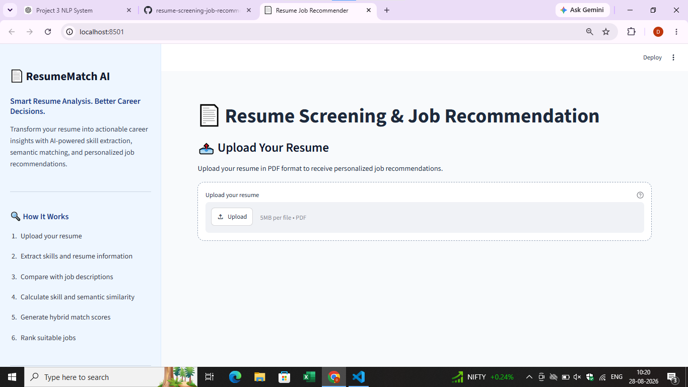
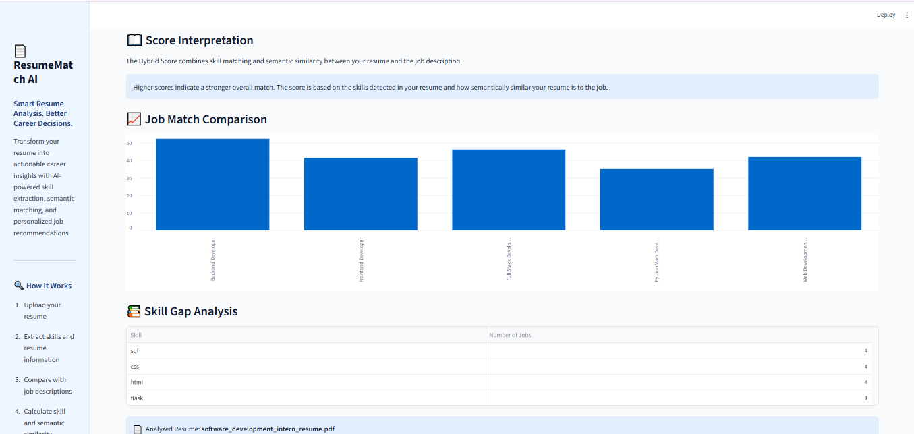

# 📄 ResumeMatch AI

### Intelligent Resume Screening & Job Recommendation System

ResumeMatch AI is an NLP-powered resume screening and job recommendation system that analyzes a candidate's resume, extracts relevant skills, compares them with job requirements, and recommends the most suitable career opportunities.

The system combines **skill matching** and **TF-IDF based semantic similarity** to calculate a hybrid resume-job compatibility score.
---

## 🚀 Features

* 📄 Upload resumes in PDF format
* 🔍 Automatic resume text extraction
* 🧹 Text preprocessing and cleaning
* 🧠 Automatic technical skill extraction
* 🎯 Career domain recommendation
* 💼 Job recommendation and ranking
* 📊 Skill-match score calculation
* 🔎 TF-IDF based semantic similarity
* ⚖️ Hybrid resume-job matching score
* 📚 Matched, missing, and extra skill identification
* 🏆 Match-strength classification
* 📈 Domain-wise recommendation scores
* 🌐 Interactive Streamlit web interface

---

## 🧠 How It Works

ResumeMatch AI follows a complete NLP-based recommendation pipeline:

Resume PDF
↓
Resume Text Extraction
↓
Text Preprocessing
↓
Skill Extraction
↓
Job Description Processing
↓
Skill Matching
↓
TF-IDF Semantic Similarity
↓
Hybrid Score Calculation
↓
Job Ranking
↓
Career Domain Recommendation
↓
Skill Gap Analysis

---

## 📊 Recommendation Method

The system evaluates every job using two major components.

### 1. Skill Matching

The extracted skills from the resume are compared with the skills required by each job.

The system identifies:

* Matched skills
* Missing skills
* Extra skills

The skill-match percentage represents how many of the required job skills are present in the candidate's resume.

---

### 2. Semantic Similarity

ResumeMatch AI uses **TF-IDF (Term Frequency-Inverse Document Frequency)** and **cosine similarity** to measure the textual similarity between the resume and the job description.

This helps the system identify relationships between the resume content and job requirements beyond direct skill matching.

---

### 3. Hybrid Score

The final recommendation score combines skill matching and semantic similarity.

The current weighting is:

* **Skill Match: 60%**
* **Semantic Similarity: 40%**

Therefore, the skill component has a greater influence on the final recommendation while semantic similarity provides additional contextual information.

---

## 🎯 Match Strength

Each recommended job is assigned a match-strength category based on its hybrid score.

| Hybrid Score | Match Strength  |
| ------------ | --------------- |
| 80–100       | Excellent Match |
| 65–79.99     | Strong Match    |
| 50–64.99     | Moderate Match  |
| Below 50     | Weak Match      |

---

## 💼 Career Domain Recommendation

The system calculates the average hybrid score of jobs belonging to each career domain.

The domain with the highest average score is recommended as the candidate's strongest career domain.

Currently supported domains include:

* 🤖 AI/ML
* 📊 Data Science
* 📈 Data Analytics
* 🔬 Research
* 🌐 Web Development

---

## 🛠️ Tech Stack

### Programming Language

* Python

### Data Processing

* Pandas
* NumPy

### Natural Language Processing

* NLTK
* TF-IDF Vectorization
* Cosine Similarity

### Machine Learning

* Scikit-learn

### Resume Processing

* PyMuPDF
* python-docx

### Data Visualization

* Matplotlib
* Seaborn

### Application

* Streamlit

### Development

* Jupyter Notebook
* VS Code
* Git
* GitHub

---

## 📁 Project Structure

```text
resume-screening-job-recommendation/
│
├── app/
│   └── app.py
│
├── src/
│   ├── __init__.py
│   ├── preprocessing.py
│   ├── resume_parser.py
│   ├── skill_extraction.py
│   ├── skill_matching.py
│   ├── semantic_matching.py
│   ├── match_score.py
│   ├── job_processing.py
│   └── recommendation_engine.py
│
├── notebooks/
│   ├── 01_nlp_basics.ipynb
│   ├── 03_resume_parsing.ipynb
│   ├── 04_skill_extraction.ipynb
│   └── 05_resume_job_matching.ipynb
│
├── tests/
│
├── data/
│   ├── raw/
│   └── processed/
│
├── main.py
├── requirements.txt
├── .gitignore
└── README.md
```

> Some additional modules may be present in the `src/` directory as part of the project's development and experimentation process.

---

## ⚙️ Installation

### 1. Clone the repository

```bash
git clone https://github.com/dPro-123/resume-screening-job-recommendation.git
```

### 2. Navigate to the project directory

```bash
cd resume-screening-job-recommendation
```

### 3. Create a virtual environment

Windows:

```bash
python -m venv venv
```

Activate it:

```bash
venv\Scripts\activate
```

### 4. Install dependencies

```bash
pip install -r requirements.txt
```

---

## ▶️ Run the Application

Start the Streamlit application using:

```bash
streamlit run app/app.py
```

The application will open in your browser.

If the `streamlit` command is not recognized, use:

```bash
python -m streamlit run app/app.py
```

---

## 📄 Using ResumeMatch AI

### Step 1

Open the Streamlit application.

### Step 2

Upload a resume in PDF format.

### Step 3

Click the **Analyse Resume** button.

### Step 4

The system processes the resume and extracts relevant skills.

### Step 5

The system compares the resume against available job descriptions.

### Step 6

The application displays:

* Recommended career domain
* Domain score
* Recommended jobs
* Skill-match score
* Semantic similarity score
* Hybrid score
* Match strength
* Matched skills
* Missing skills
* Extra skills

---

## Application screenshots
🖥️ Application Screenshots

🏠 Home Page




📊 Resume Analysis


💼 Job Recommendations



## 📌 Example Recommendation

A recommendation generated by the system can contain information such as:

```text
Recommended Domain: Data Science

Job Title: Machine Learning Intern
Domain: AI/ML

Skill Match Score: 100%
Semantic Score: 48.05%
Hybrid Score: 79.22%

Match Strength: Strong Match

Matched Skills:
- Machine Learning
- Python
- Scikit-learn
- SQL
```

The scores shown above are an example of the application's output format.

---

## 🔬 NLP Techniques Used

### Text Preprocessing

Resume and job-description text is cleaned before further processing.

The preprocessing pipeline prepares the textual data for skill extraction and similarity calculation.

### Skill Extraction

The system identifies relevant technical skills from resume content and job requirements.

### TF-IDF

TF-IDF converts textual documents into numerical feature vectors based on the importance of terms.

### Cosine Similarity

Cosine similarity measures the similarity between the resume representation and the job-description representation.

### Hybrid Recommendation

The final score combines skill matching with semantic similarity to produce a more comprehensive job-match score.

---

## 📈 Skill Gap Analysis

ResumeMatch AI does not only identify suitable jobs.

It also helps candidates understand what skills they may need to improve.

For each recommended job, the system can identify:

### Matched Skills

Skills present in both the resume and job requirements.

### Missing Skills

Required job skills that were not found in the resume.

### Extra Skills

Skills present in the resume that are not required for that particular job.

This provides a simple **skill-gap analysis** that can help candidates identify areas for improvement.

---

## 🔮 Future Improvements

Possible future improvements include:

* 🤖 Transformer-based semantic embeddings
* 🧠 BERT/Sentence-BERT based similarity
* 🎯 Improved skill extraction using NLP models
* 📊 Advanced candidate ranking
* 🏢 Larger and more diverse job datasets
* 🔎 Industry-specific recommendations
* 📈 Interactive analytics dashboard
* 🧑‍💼 Recruiter-oriented screening interface
* 💡 Personalized skill-learning recommendations
* ☁️ Cloud deployment
* 🔐 Improved privacy and secure resume processing

---

## ⚠️ Dataset & Privacy

The project's private/local datasets are not included in the public repository.

The `.gitignore` configuration prevents local raw and processed data from being uploaded accidentally.

Users should avoid uploading resumes containing sensitive personal information to publicly accessible repositories or services.

---

## 🧪 Development & Experiments

The project was developed incrementally using Jupyter notebooks and Python modules.

The notebooks contain experimentation and learning stages related to:

* NLP fundamentals
* Resume parsing
* Skill extraction
* Resume-job matching

The final Streamlit application integrates the developed components into a single user-facing system.

---

## 📦 Requirements

The main dependencies include:

* numpy
* pandas
* scikit-learn
* nltk
* matplotlib
* seaborn
* jupyter
* streamlit
* pymupdf
* python-docx

For the complete dependency list and versions, refer to:

```text
requirements.txt
```

---

## 👨‍💻 Author

**Deepratim Ghosh**

Computer Science & Engineering Student

GitHub: https://github.com/dPro-123

LinkedIn: https://www.linkedin.com/in/deepratim-ghosh/

---

## ⭐ Project Goal

ResumeMatch AI was developed to explore how Natural Language Processing and similarity-based techniques can be used to automate resume screening and job recommendation.

The project focuses on combining **skill-based matching, semantic similarity, ranking, and skill-gap analysis** into a practical end-to-end NLP application.

---

## 📜 License

This project is intended for educational and portfolio purposes.
